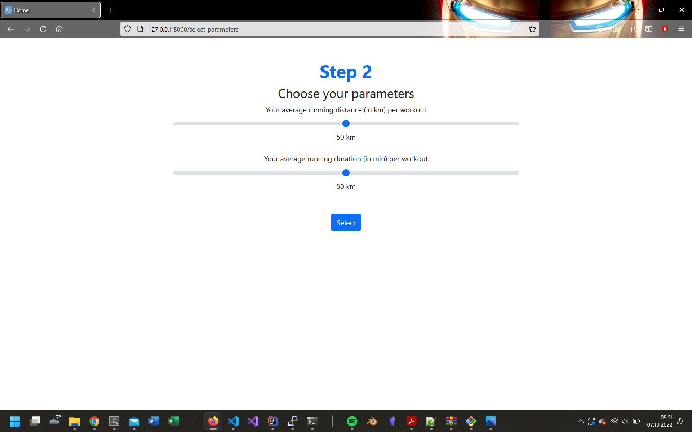

# AIYungsters present to you: Contoso spots
We developed a smart vest that guides you during your routes! 
Our innovative integrated LEDs show the way for routes recommend to you. It tracks your routes and you can challenge people and celebreties. Those are recommend using our AI services based on duration and distance of similar routes.

 
# Team
 
Left to right:  
Maximilian Studt 
Dionysis Mitosios 
Azur Causevic 
Konrad Wehner  
Thore Koritzius 

# Images
Deployement worked locally, however, we have issues with the ML container remote

 
 
 
 

# Software Stack
 
The Backend utilitzes a python flask server connected to our PostrgreSQL. 
There we deployed three databases: routes, tracks, accounts. 
Our Model is exported as .pkl from the Azure ML container. We then do inference on it in our backend. 
To simulate data from the user, he can select avg distance and duration and get a match 